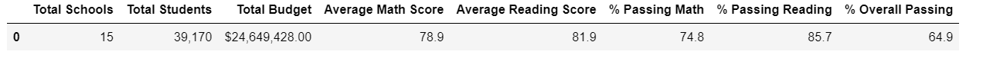
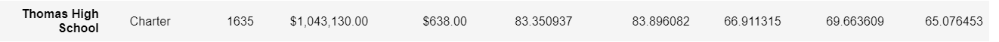
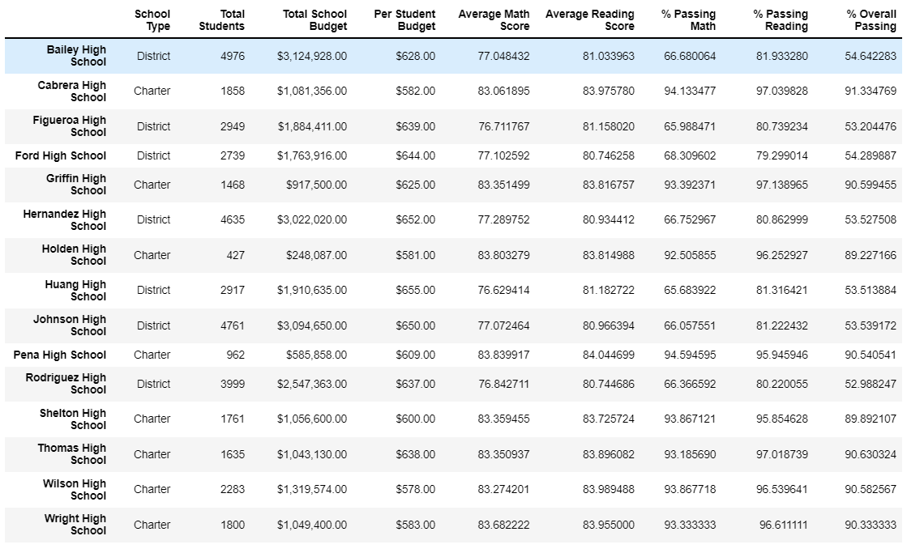
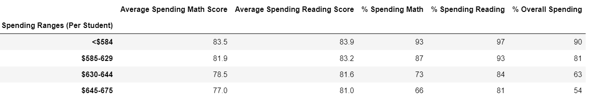
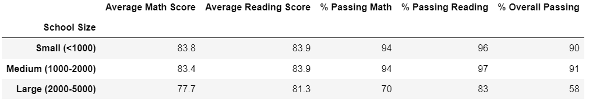
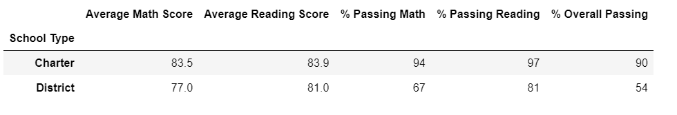

# District School Analysis
Analysis of standardized test, reports, and presentation of insights performance trends and patterns. Including the student funding and standardized test scores.

## Overview of Project 
### Purpose 
The purpose of this new analysis is know the performance of students and the relation with the student funding, trying to have the more clean data as possible, having the correct data of each school, changing the scores data per NaNs into Thomas High School specifically the 9th grade. Then, run the rest of the code to have the summary data frame without the dishonesty reading and math scores. 

## Results 

-How is the district summary affected?
----

In the image above, is possible to see that the average math score and average reading score change a little bit, having a similar result, before the average math score was 79 and reading score 81.9, in the new data, the total district summary showed 78.9 and 81.9 respectively, so the values practically didn´t change. The same with the percentage that was before the percentage passing Math was 75%, the percentage passing Reading 86% and the percentage overall passing was 65% and now are 74.8%, 85.7%, and 64.9%, respectively. 

-How is the school summary affected?
------

As we see in the image above, the average math score for the Thomas High School is 83.35, the average reading score is 83.90, the percentage passing math is 66.91 %, the percentage passing reading is 65.66% and the percentage overall passing is 65.08%, while before was 83.41, 83.85, 93.27%, 97.31%, and 90.95%, respectly. The percentages change more than the scores, the change into the Thomas High School, ninth grade per NaNs, has a decrease move into the percentages.   

-How does replacing the ninth graders’ math and reading scores affect Thomas High School’s performance relative to the other schools?
----

 After we replace the Thomas High School data per the students to the other grades, we realize that the performance of the students in math is 83.35 and in reading is 83.90, these values are similar to other schools, like Cabrera High School, Griffin High School, Pena High School, Shelton High School, Wilson High School, and Wright High School. In the image above, we can see the references. 

-How does replacing the ninth-grade scores affect the following:
---
*Math and reading scores by grade
---
The math and reading scores by grades are the same, talking about Thomas High School are for 9th grade =83.7, for 10th grade = 84.3, for 11th grade= 83.6, and for 12th grade is 83.8.

*Scores by school spending
---

The scores are the same as before. Less than $584 has more percentage of spending, in Math, 93%, 97% and 90% overall, just 66% have a spending per student between %645 and $675 in math.

*Scores by school size
----

The scores are the same as before. A medium school has 94% passing math, the same percentage as small, 97% passing reading, and finally 91% overall passing. The large school has only 58% overall passing.

*Scores by school type
---

The scores are the same as before. There are more Charter school passing percentages, 94% passing math, 97% passing Reading, and 90% overall passing, District school has 54% overall passing.

### Summary
 Talking about the total district summary including 15 schools and 39,170 students the average math score, percentage passing math, percentage passing reading and percentage overall passing dicrease a little bit, the average reading score is the same. While, the school summary of thomas High school specific is lower before the replace of data, having the lowest scores and percentages, after the replace of data, the thomas High School with 1,635 students containing all grades, has a lower percentages of passing math, reading and overall. Finally, it´s important to mention that Thomas High School are a small part of all the district this is why the changes are small, also we only change the 9th grade, so now our data are more precise, even though it seems similar. 
